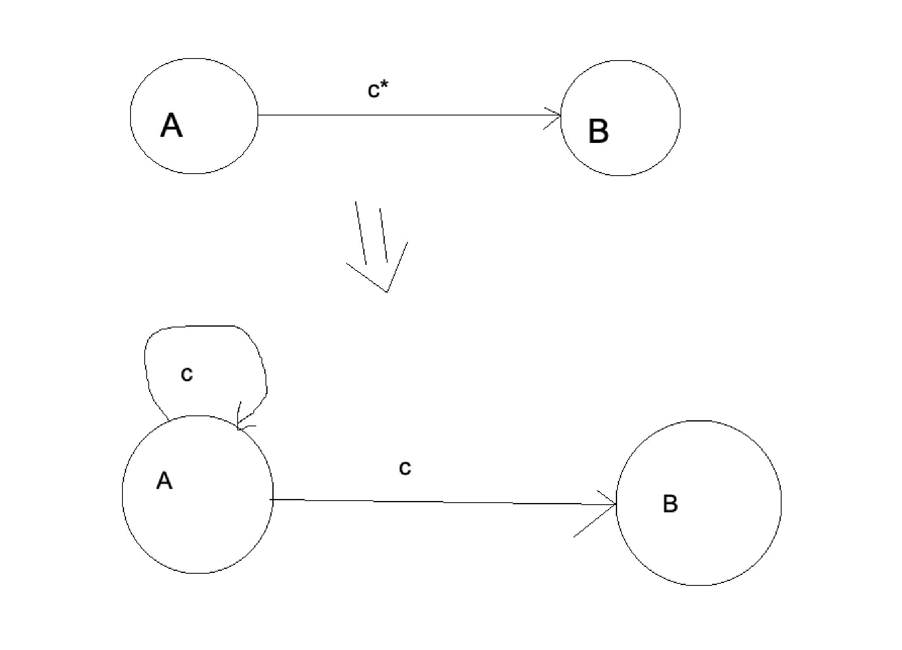
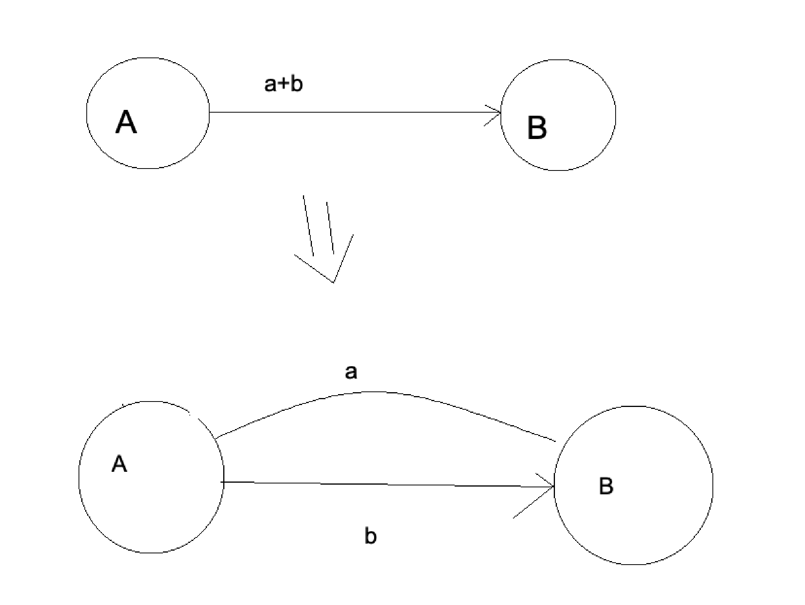
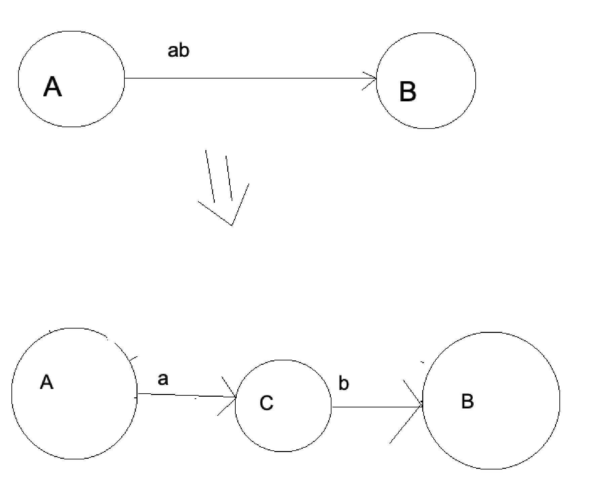

# Q1
First we create a simple NFA, with a start state, and an edge that represents the input regex going to the final state. 

Now, we do the following until each edge in the NFA reprresents a simple letter. We take edges and find the first operation on which it can be split. We then split it.

For example, if we have 
`(a)*` where a is a regex, then the split is keene star.
`(a)+(b)` where a,b is some regex, then the split is union.

The diagrams below show what we do for each of the kinda of splits

**kleene star**

**union**

**concatenation**

# Q2
This is converting a NFA to a DFA. The letters of the NFA and the DFA are the same. The states of the DFA in the power set of the states of the NFA. The start state of the DFA is the state which contains all the start states of the NFA, and no other states. The final states of the DFA are the states which contain atleast one final state of the NFA. The transition matrix is made by mapping all the states we have in the DFA to another state in the DFA with all the letters possible, by use of the NFA's transition matrix.

# Q3
To convert DFA to regex, we use state reduction.

We add a new final state, and connect all the DFAs final states to this new one by $s. We do the same for all the start state.

We then do the following till we only have our new start state and our new final state left.

first we find all parrallel edges between all pairs states and make them into one edge.

Second we deal with all self loops. For a self loop with a a state A and the loops letter being b, we find all edges going out of A and add (b*) to the start of the letter those edges.

Then we choose any one state and delete it, and then go back to the first step. We delete a state by making an edge for every pair of ingoing and outgoing edge for the state.

# Q4

To minimize a DFA,
First we remove all the non-reachable states.
Then we create a partition array P0 which initially contains 2 sets. The first set contains all the states which are final states and the second set contains the rest of them.

Then we use the following steps to generate Pi+1 from Pi.

We partition each set in Pi such that the new sets contain elements which are identical.

Two elements are said to be identical, if for all letters int he language, they map to elements that belond to the same set in Pi.

We keep doing this until Pi is the same as Pi+1

Once we have the final P. We generate the new transition matrix from the original transition matrix by mapping the sets in P to other sets in P for each letter. This works as each set contains elements that are identical.

Any set with a start state becomes a start state for the new DFA, and any set  with a final state becomes a final state for the new DFA.